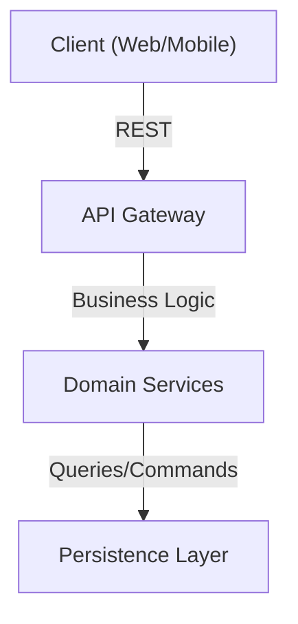
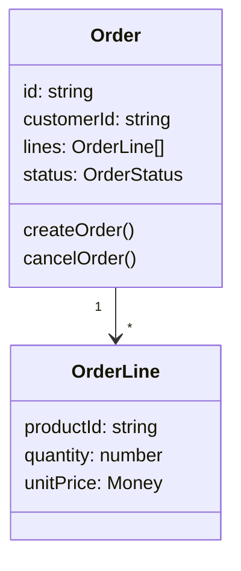
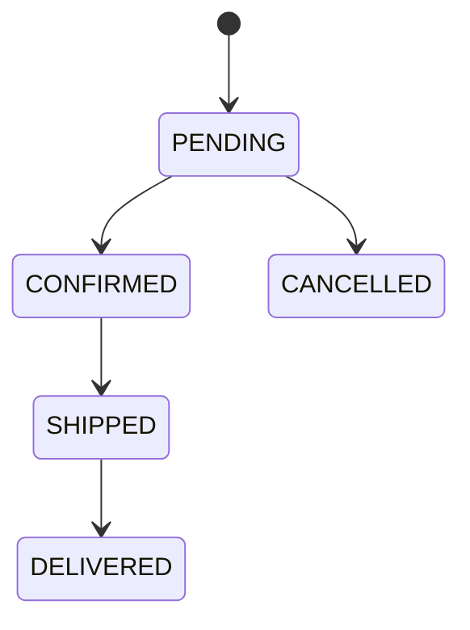

# Documentation Guidelines

## Philosophie

**Visuel > Textuel**

Documentation claire et rapide à comprendre. Préférer les diagrammes, tableaux et exemples visuels au texte long.

---

## 1. Documentation dans le Code

### **Interfaces & Types**
Documenter le contrat public : entrées, sorties, comportement, exceptions.

```typescript
/**
 * Crée une commande avec les articles spécifiés.
 * 
 * @param customerId - ID unique du client
 * @param items - Liste des articles (non vide)
 * @returns Promesse de la commande créée avec ID généré
 * @throws OrderValidationError si les items sont invalides
 * @throws CustomerNotFoundError si le client n'existe pas
 */
async createOrder(customerId: string, items: OrderItem[]): Promise<Order>
```

### **Fonctions Publiques**
- Purpose : pourquoi existe cette fonction
- Params : types + descriptions courtes
- Returns : type + comportement
- Throws : exceptions possibles
- Example (optionnel) : utilisation simple

```typescript
/**
 * Calcule la TVA à appliquer sur un montant.
 * 
 * @param amount - Montant HT en euros
 * @param countryCode - Code pays (ISO 3166-1 alpha-2)
 * @returns TVA arrondie à 2 décimales
 * 
 * @example
 * calculateVAT(100, 'FR') // 20
 * calculateVAT(100, 'DE') // 19
 */
function calculateVAT(amount: number, countryCode: string): number
```

### **Classes & Enums**
Expliquer le rôle, pas l'implémentation.

```typescript
/**
 * Règles de validation des commandes.
 * 
 * Assure que :
 * - Le client existe
 * - Au minimum 1 article
 * - Pas d'articles en double
 * - Total > 0
 */
class OrderValidator {
  validate(order: Order): ValidationResult { }
}

/**
 * États possibles d'une commande.
 * Transition : PENDING → CONFIRMED → SHIPPED → DELIVERED
 */
enum OrderStatus {
  PENDING = 'pending',
  CONFIRMED = 'confirmed',
  SHIPPED = 'shipped',
  DELIVERED = 'delivered',
}
```

### **À NE PAS Documenter**
- Getters/setters triviaux
- Constructeurs évidents
- Tests (code auto-documenté)
- Code qui explique déjà son intention

---

## 2. Fichiers Markdown dans le Projet

### **Structure de documentation**
```
docs/
  ├── README.md              (Index, getting started)
  ├── architecture/
  │   ├── overview.md        (Vue générale, diagrammes)
  │   └── domain-model.md    (Modèle métier, DDD)
  ├── development/
  │   ├── setup.md           (Installation)
  │   ├── testing.md         (Stratégie de test)
  │   └── conventions.md     (Style, nomenclature)
  ├── api/                   (Si applicable)
  │   └── endpoints.md
  └── deployment/
      └── aws.md
```

### **Recommandations par fichier**

#### **README.md (Root)**
- 1 phrase : c'est quoi
- Quick start (5 min max)
- Table of contents
- Links vers docs détaillées

#### **Architecture Overview**
- Diagrammes : layers, bounded contexts, data flow
- Utiliser Mermaid ou PlantUML

```markdown
## High-Level Architecture


```

#### **Data Model / Domain**
- Diagrammes des entités et relations
- Explications des value objects clé

```markdown
## Order Aggregate


```

#### **API Endpoints** (si public)
- Table : Method, Path, Input, Output
- Utiliser OpenAPI/Swagger si possible
- Exemples cURL

#### **Testing Strategy**
- Pyramid : Unit / Integration / E2E ratios
- Où trouver les tests
- Comment lancer les tests

```markdown
## Running Tests

| Command | Purpose |
|---------|---------|
| `npm test` | Unit tests |
| `npm run test:integration` | Integration tests |
| `npm run test:e2e` | End-to-end tests |
| `npm run test:coverage` | Coverage report |
```

---

## 3. Impacts à Reporter

### **En cas de changement architecture ou API**
Mettre à jour le README du projet :

#### **À updater automatiquement**
- [ ] Version bump (si applicable)
- [ ] Breaking changes (section dédiée)
- [ ] Nouvelle dépendance majeure → ajouter à "Dependencies" section

#### **Template : Breaking Changes**
```markdown
## [v2.0.0] - 2025-01-15

### Breaking Changes
- ❌ Method `calculateDiscount()` → removed
- ✅ Use `PricingService.applyDiscount()` instead
- ⚠️ OrderStatus enum changed: `IN_PROGRESS` → `PENDING`

### Migration Guide
[Link to migration doc]
```

#### **Template : Impacts sur README**
```markdown
## Architecture Changes

- **Bounded Context** : Added "Payment" context (DDD)
- **API** : New `/payments/*` endpoints
- **Dependencies** : Added Stripe SDK (see guidelines/security.md)
- **Tests** : Payment tests in `src/payment/__tests__/`
```

### **Timing**
- ✅ Pendant la PR : updater la doc avec le code
- ✅ Avant le merge : validation par reviewer
- ❌ Jamais après le merge (doc out-of-sync)

---

## Diagrammes Recommandés

| Besoin | Outil | Langage |
|--------|-------|---------|
| Architecture layers | Mermaid | `graph TB` |
| Entities & Relations | Mermaid | `classDiagram` |
| Domain Events Flow | Mermaid | `sequenceDiagram` |
| State Machine | Mermaid | `stateDiagram-v2` |
| Database Schema | PlantUML | `entity-relationship` |

Exemple Mermaid inline :
```markdown

```

---

## Review Checklist

- [ ] Interfaces et fonctions publiques documentées
- [ ] Paramètres, retours et exceptions explicites
- [ ] Diagrammes à jour si architecture change
- [ ] README updated avec impacts (breaking changes, nouvelles sections)
- [ ] Pas de texte inutile : visuel et exemples > prose
- [ ] Documentation incluse dans PR, pas "TODO later"
